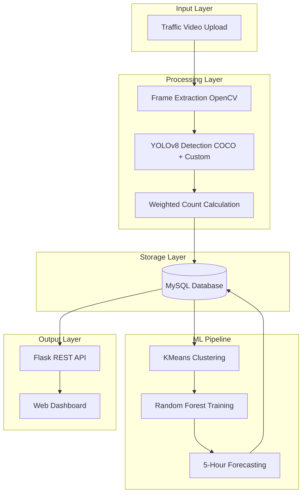
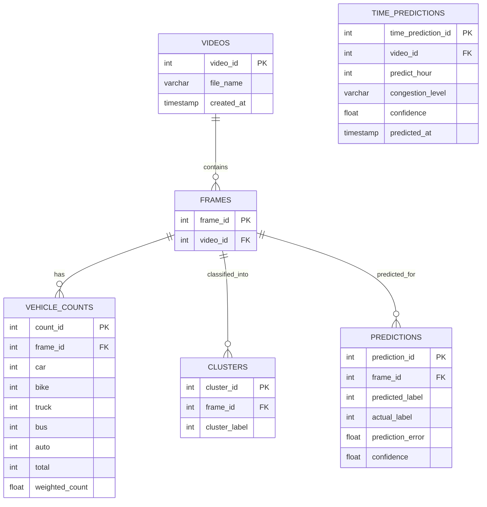

# Urban Grid Watch

An AI-powered traffic monitoring and congestion prediction system that detects vehicles from traffic videos, classifies congestion levels using machine learning, and forecasts future traffic trends through an interactive web dashboard.

---

## Table of Contents

- [Features](#features)
- [Tech Stack](#tech-stack)
- [System Architecture](#system-architecture)
- [Getting Started](#getting-started)
  - [Prerequisites](#prerequisites)
  - [Installation](#installation)
  - [Environment Setup](#environment-setup)
  - [Running Locally](#running-locally)
- [Project Structure](#project-structure)
- [API Endpoints](#api-endpoints)
- [Database Schema](#database-schema)

---

## Features

- **Video Upload and Processing:** Accepts CCTV or traffic video uploads via REST API.
- **Frame Extraction:** Uses OpenCV to extract frames at configurable intervals for analysis.
- **Vehicle Detection:** Dual YOLOv8 model pipeline combining COCO pre-trained weights and a custom Roboflow-trained model.
- **Weighted Congestion Index:** Calculates congestion severity using vehicle-type weighting (car, bike, auto, truck, bus).
- **KMeans Clustering:** Classifies frames into 5 congestion levels through unsupervised clustering.
- **Random Forest Prediction:** Trains an optimized classifier using GridSearchCV with cross-validation.
- **5-Hour Forecasting:** Predicts congestion levels for the next 5 hours with confidence scoring.
- **Interactive Dashboard:** Visualizes predictions, confidence graphs, YOLO-detected video playback, and performance metrics.

---

## Tech Stack

| Layer | Technology |
|-------|------------|
| Backend | Python, Flask |
| ML / AI | YOLOv8, Scikit-learn, OpenCV, NumPy, Pandas |
| Clustering | KMeans (5 clusters) |
| Classification | Random Forest with GridSearchCV |
| Database | MySQL |
| Frontend | HTML5, CSS3, JavaScript, Chart.js |
| Model Serialization | Joblib |

---

## System Architecture



---

## Getting Started

### Prerequisites

- Python 3.9 or higher
- MySQL Server
- pip package manager

### Installation

1. Clone the repository:
   ```bash
   git clone https://github.com/bhaavyasura7/traffic-congestion-prediction.git
   cd traffic-congestion-prediction
   ```

2. Install Python dependencies:
   ```bash
   cd ml2
   pip install -r requirements.txt
   ```

### Environment Setup

Configure MySQL connection settings in the following files before running:

- `ml2/test2.py`
- `ml2/phase3_prediction.py`
- `ml2/congestion_predictor.py`
- `ml2/backend_server.py`

Update the database credentials:
```python
host="localhost"
user="root"
password="your_password"
database="ml"
```

### Running Locally

#### Step 1: Video Detection and Clustering
```bash
cd ml2
python test2.py <path_to_video_file>
```

#### Step 2: Train Prediction Model
```bash
python phase3_prediction.py
```

#### Step 3: Generate 5-Hour Forecast
```bash
python congestion_predictor.py
```

#### Step 4: Launch Flask API and Dashboard
```bash
python backend_server.py
```

Access the dashboard at:
```
http://localhost:5000
```

Alternatively, run the full pipeline using:
```bash
bash run.sh
```

### Default Ports

| Service | Port | Description |
|---------|------|-------------|
| Flask API | 5000 | Backend server and dashboard hosting |
| MySQL | 3306 | Database server |

---

## Project Structure

```
traffic-congestion-prediction/
├── ml2/
│   ├── backend_server.py        # Flask REST API and dashboard server
│   ├── test2.py                 # Frame extraction and YOLO detection
│   ├── phase2_clustering.py     # KMeans congestion clustering
│   ├── phase3_prediction.py     # Random Forest model training
│   ├── congestion_predictor.py  # 5-hour traffic forecasting
│   ├── requirements.txt         # Python dependencies
│   ├── run.sh                   # Full pipeline execution script
│   ├── yolov8n.pt               # COCO pre-trained YOLO weights
│   ├── traffic_model_*.joblib   # Trained model artifacts
│   ├── data/                    # Raw videos and detection outputs
│   ├── runs/                    # YOLO training runs
│   ├── train/                   # Training dataset
│   ├── valid/                   # Validation dataset
│   └── dashboard/
│       ├── index.html           # Main dashboard page
│       ├── chartjs.html         # Chart visualization page
│       ├── app.js               # Dashboard JavaScript
│       ├── style.css            # Dashboard styles
│       └── data/
│           ├── model_performance.json
│           └── prediction.json
└── README.md
```

---

## API Endpoints

| Method | Endpoint | Description |
|--------|----------|-------------|
| POST | `/upload` | Upload a traffic video for processing |
| GET | `/dashboard/data/<filename>` | Serve processed video and JSON data files |

### Upload Response
```json
{
  "success": true,
  "path": "/absolute/path/to/video.mp4",
  "model_performance": "{...}",
  "prediction": "{...}"
}
```

---

## Database Schema


